# Nagrik Sewa - Project Flowchart

## System Architecture Overview

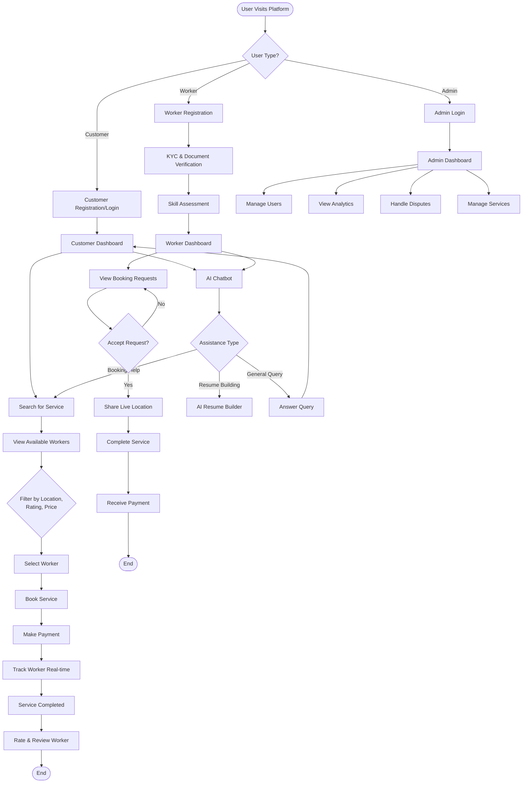

## Detailed Technical Flow

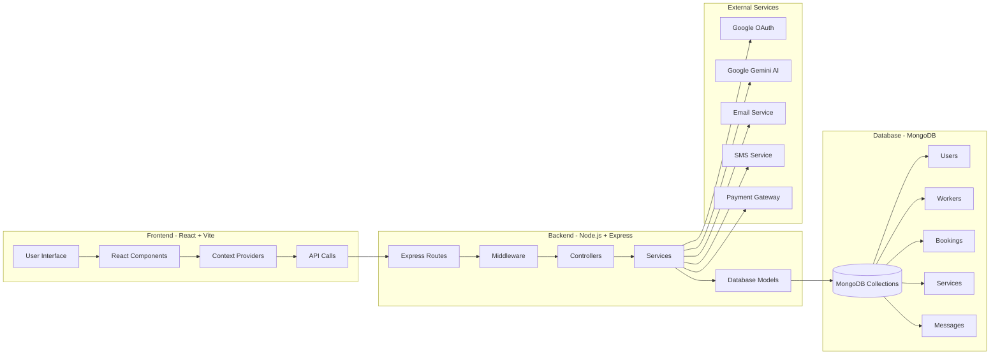

## User Authentication Flow

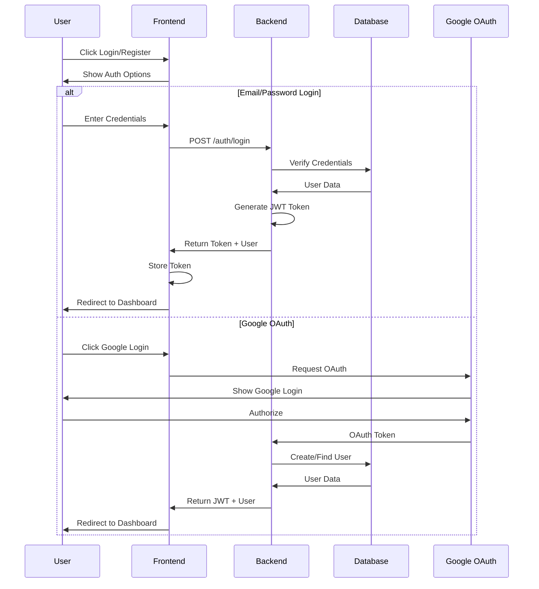

## Service Booking Flow

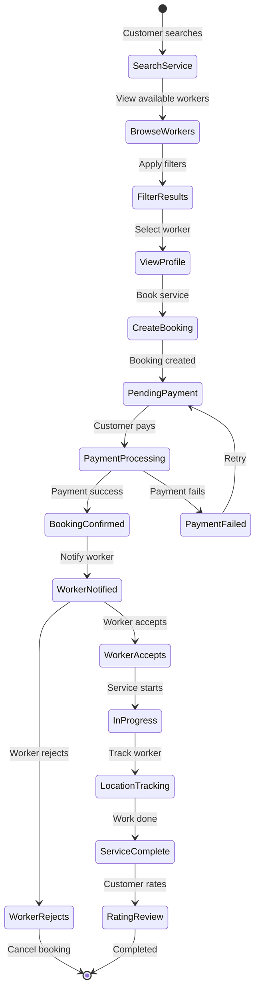

## AI Chatbot Interaction Flow

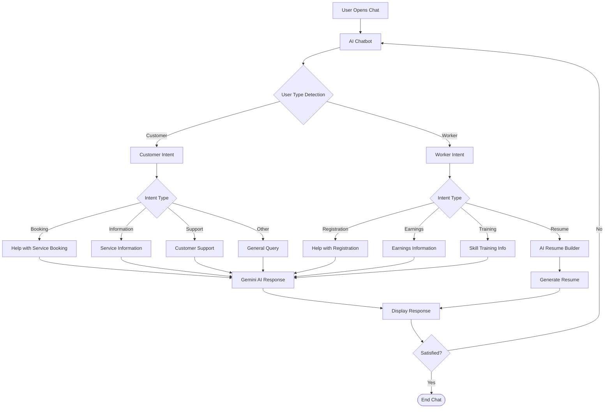

## Payment Processing Flow

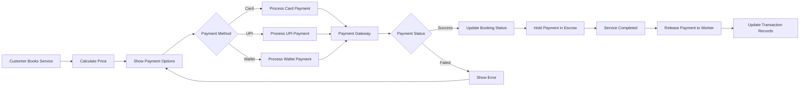

## Real-time Location Tracking

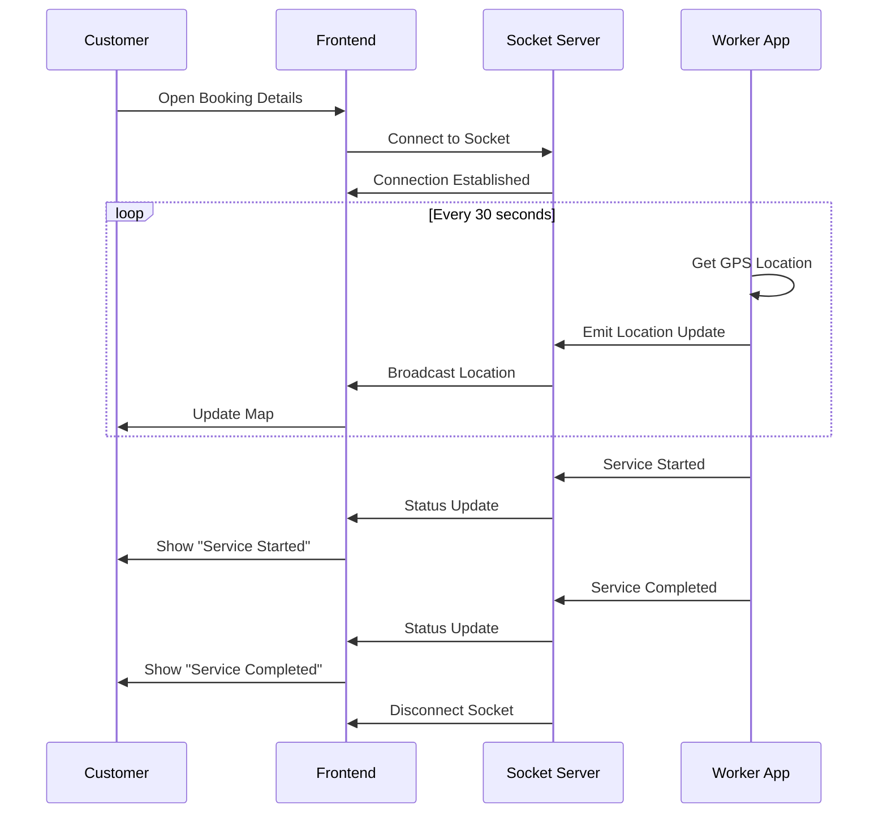

## Data Models Relationship

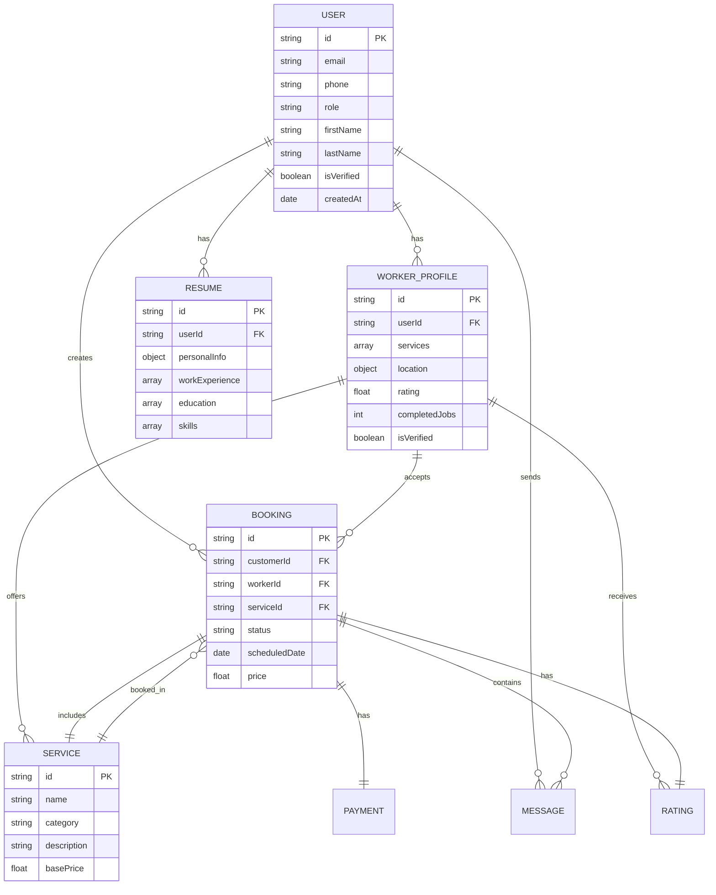

## Multi-Language Support Flow

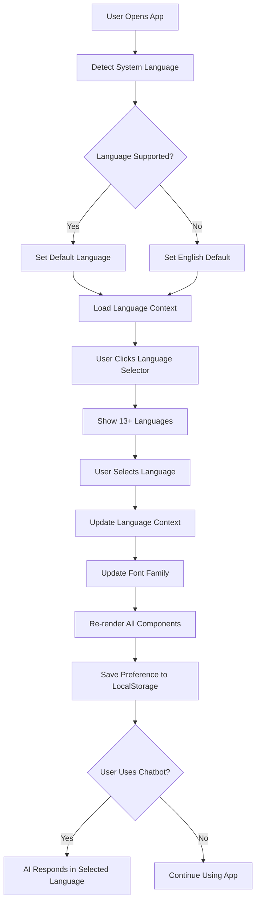

## Security & Verification Flow

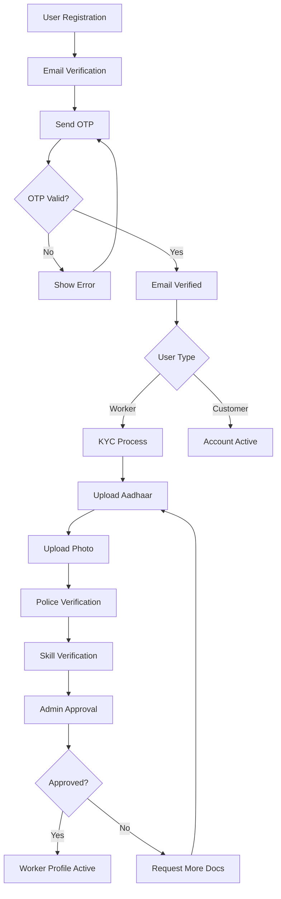

## Admin Dashboard Operations

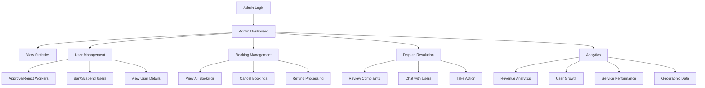

## Emergency SOS Flow

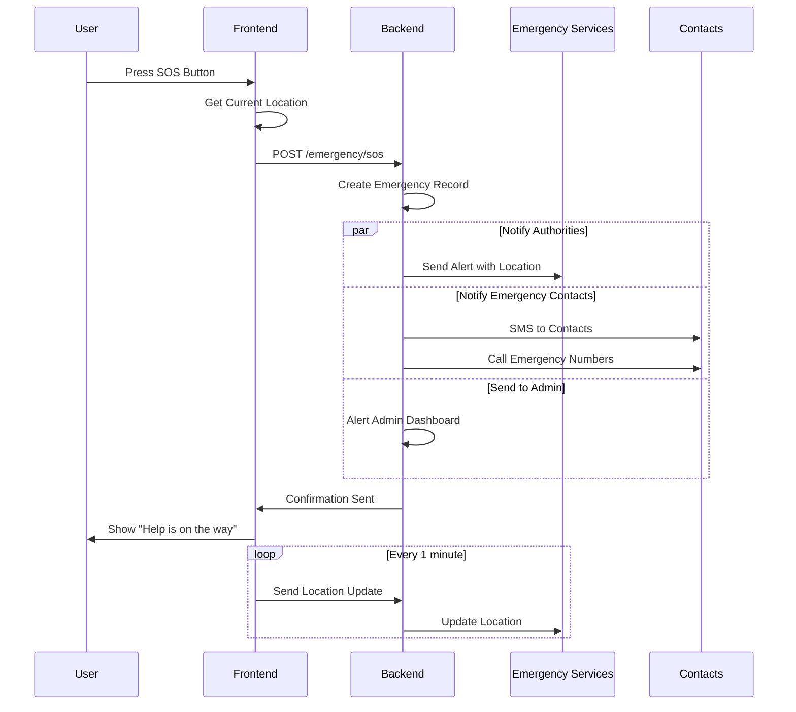

## Resume Builder AI Flow

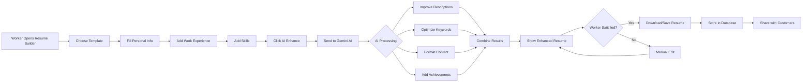

---

## Technology Stack Flow

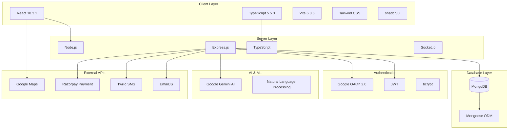

---

## Deployment Architecture

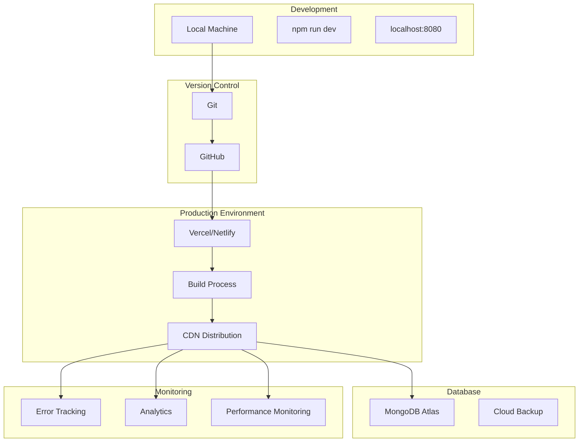

